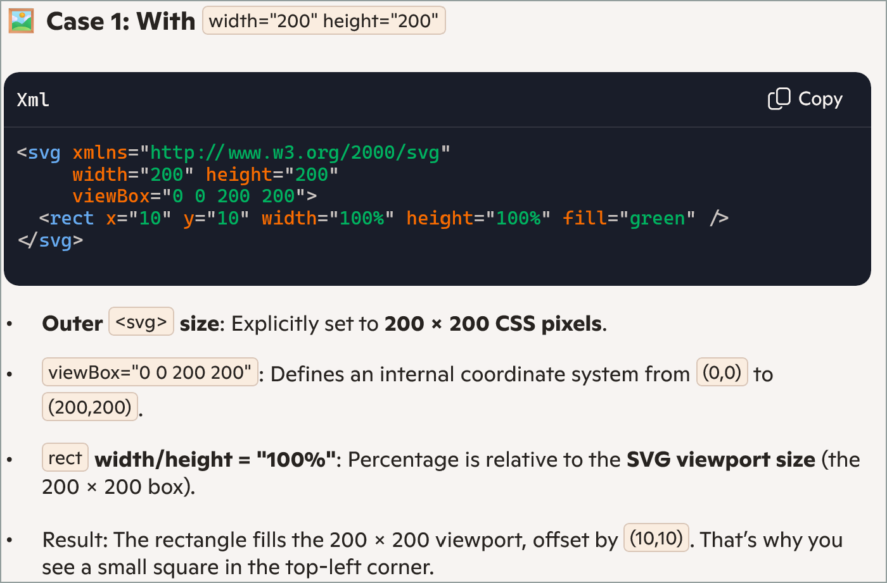
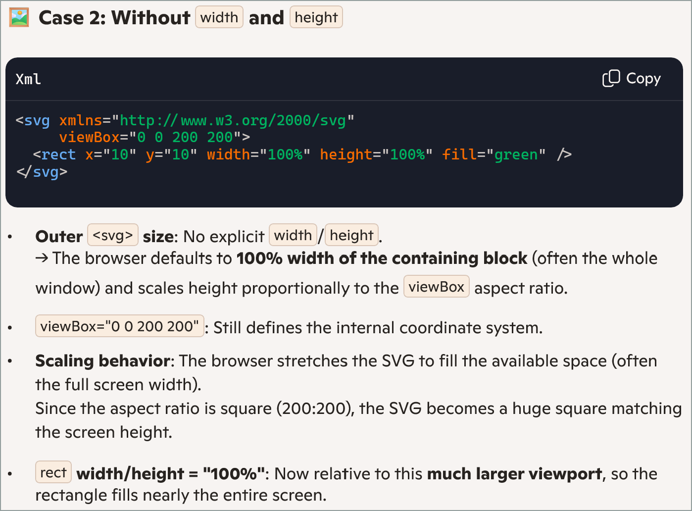
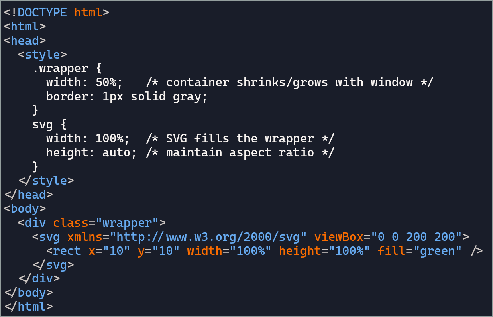

# svg 101
### Coding without snippets to get the hang

#### Main playing right now is to understand fixed dimension in the outer svg

- With fixed width and height:  
The SVG is locked to those pixel dimensions. It will always try to render as a 200 × 200 box, regardless of the container or device. On a phone, desktop, or giant monitor, it stays the same size in CSS pixels.
- Without fixed dimensions (only viewBox):  
The SVG becomes responsive. The browser treats it like a fluid element that scales to fit its container. As you resize the window, the SVG shrinks or grows while maintaining the aspect ratio defined by the viewBox. That’s why dragging the browser narrower makes the square shrink proportionally.

I then moved on to getting a 'truly' responsive svg rectangle

- SVG alone in HTML: behaves like a fixed image unless you explicitly tie its size to a container.  
- SVG inside a resizable container: becomes responsive, scaling with that container.

